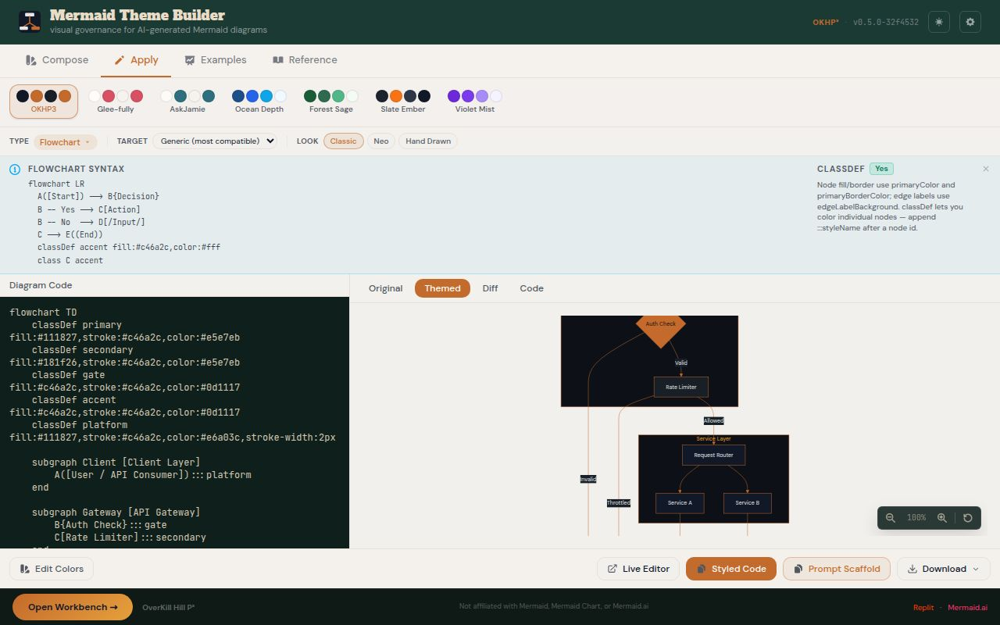

# Mermaid Theme Builder

Visual governance for AI-generated Mermaid diagrams — paste, theme, preview, and export with renderer-aware scaffolding. Reduces follow-on AI prompts with pre-prompt scaffold exports tuned for your target renderer.

**[Live Tool](https://okhp3.github.io/mermaid-theme-builder/)** · **[Project Page](https://overkillhill.com/projects/mermaid-theme-builder/)** · **[Article](https://overkillhill.com/writings/first-diagram-is-a-liar/)**



---

## Features

- **27+ diagram families** detected with family-specific theming overlays
- **3 rendering looks** — Classic, Neo, Hand-Drawn — sourced from Mermaid v11.15.0's look API
- **7 renderer profiles** — mermaid.live, GitHub, GitLab, Notion, Obsidian, Confluence, CLI — with parity matrix and contextual look warnings
- **5-tier typography hierarchy** — Diagram Title → Subgraph → Nested Subgraph → Node Label → Edge Label — with enforced parent-child sizing constraints
- **Built-in brand palettes** — Overkill Hill P³, AskJamie, Glee-fully, plus Ocean Depth, Forest Sage, Slate Ember, Violet Mist and more
- **Two-way color editor** — click swatches, preview updates live
- **Three export formats** — Styled Code, Markdown Bootstrap, AI Prompt Scaffold
- **Renderer-aware warnings** — contextual alerts when selected look is unsupported by target renderer
- **Extract mode** — pull theme from existing themed Mermaid code
- **100% client-side** — no backend, no login, no data collection

---

## Tabs

| Tab | Purpose |
|-----|---------|
| **Apply** | Paste Mermaid code → select palette → select look → select renderer target → preview live → export |
| **Compose** | Design a theme from scratch, configure 5-tier typography, export prompt scaffold for LLM pre-prompting |
| **Examples** | Browse diagram examples by family, preview with current theme, load into Apply |
| **Reference** | Diagram capability registry, renderer parity matrix, class library |

---

## Looks (Mermaid v11.15.0)

| Look | Keyword | Renderer support |
|------|---------|-----------------|
| Classic | (default, omit look key) | Universal |
| Neo | `"look": "neo"` | mermaid.live, GitHub (partial), CLI, Obsidian (partial) |
| Hand-Drawn | `"look": "handDrawn"` | mermaid.live, CLI, Obsidian (partial) — requires Rough.js |

> **Note:** Notion and Confluence plugin renderers support Classic only. GitHub's pinned Mermaid version determines Neo look availability.

---

## Renderer Parity Matrix (summary)

| Renderer | Classic | Neo | Hand-Drawn | themeVars | CSS inject |
|----------|---------|-----|------------|-----------|-----------|
| mermaid.live | Full | Full | Full | Full | Full |
| GitHub | Full | Partial | None | Full | None |
| GitLab | Full | Partial | None | Full | None |
| Notion | Full | None | None | Partial | None |
| Obsidian | Full | Partial | Partial | Full | Partial |
| Confluence + Plugin | Partial | None | None | Partial | None |
| CLI (mmdc) | Full | Full | Full | Full | Full |

Full parity matrix with caveats is available in the **Reference** tab of the live tool.

---

## Supported Diagram Families (27+)

Flowchart, Sequence, Class, State, ER, Gantt, Pie, Git Graph, Mindmap, Timeline, Quadrant Chart, User Journey, Requirement, C4, Architecture Beta, Block, Sankey, XY Chart, Packet, Kanban, Radar, Treemap, Venn (beta), Ishikawa (beta), Wardley (beta), Tree View (experimental), ZenUML, Event Modeling, BPMN, ArchiMate, SysML, Value-Stream Map, Service Blueprint, OKR Alignment Map, DFD, Decision Tree, Org Chart, Threat Model DFD.

Capabilities documented per family: stability, look support, themeVariable confidence, classDef support, linkStyle support, subgraph support, `minMermaidVersion`.

---

## Exports

### Styled Code
Mermaid code with the `%%{init: ...}%%` theme directive prepended. Drop into any Mermaid renderer.

### Markdown Bootstrap
Full markdown file ready for documentation — includes fenced code block, palette reference, and theme metadata.

### AI Prompt Scaffold
Structured AI thread opener with:
- Diagram type + directive (Format A `%%{init}%%` or Format B YAML frontmatter)
- Color reference table
- 5-tier typography contract
- Semantic classDef vocabulary
- Subgraph tier patterns
- Update prompt for style drift recovery

---

## Quick Start

```bash
pnpm install
# PORT and BASE_PATH are required at runtime (set by workflow)
pnpm dev  # Use the workflow runner, not bare pnpm dev
```

See `replit.md` for the full project overview and `AGENTS.md` for contributing rules.

---

## Tech Stack

| Layer | Technology |
|-------|-----------|
| Framework | React 19 + Vite 8 |
| Styling | Tailwind CSS v4 |
| Rendering | Mermaid.js 11.15.0 |
| Type checking | TypeScript 5.9 (strict) |
| Testing | Vitest 4 |
| Package manager | pnpm 10 (workspaces) |
| Hosting | GitHub Pages (static) |

---

## Disclaimer

Not affiliated with Mermaid, Mermaid Chart, Mermaid.ai, Builders FirstSource, or any third-party brand. OverKill Hill P³ is a personal project by Jamie Hill.

## License

MIT — see [LICENSE](LICENSE).

Built by [OverKill Hill P³](https://overkillhill.com/).

---

## Agent Skill

This repo ships a SKILL.md-compatible agent skill at `skills/okhp3-mermaid-theme-builder/`. It packages the theming logic (palette registry, renderer profiles, prompt scaffold generation) into a headless, browser-free format consumable by Claude Code, GitHub Copilot, Cursor, Gemini CLI, VS Code, and OpenAI Codex.

**Skill path:** `skills/okhp3-mermaid-theme-builder/SKILL.md`

**Trigger example:**

> "Apply the OverKill Hill P³ palette to this flowchart and make it GitHub-safe"

The skill will detect the diagram family, select the appropriate themeVariables, apply renderer constraints, and return a `%%{init}%%` directive ready to paste.

**Install (Claude Code):**

```bash
cp -r skills/okhp3-mermaid-theme-builder ~/.claude/skills/
```

**Install (Cursor):**

```bash
cp skills/okhp3-mermaid-theme-builder/SKILL.md .cursor/rules/mermaid-theme-builder.mdc
```

See `skills/okhp3-mermaid-theme-builder/README.md` for full install instructions for all platforms.
