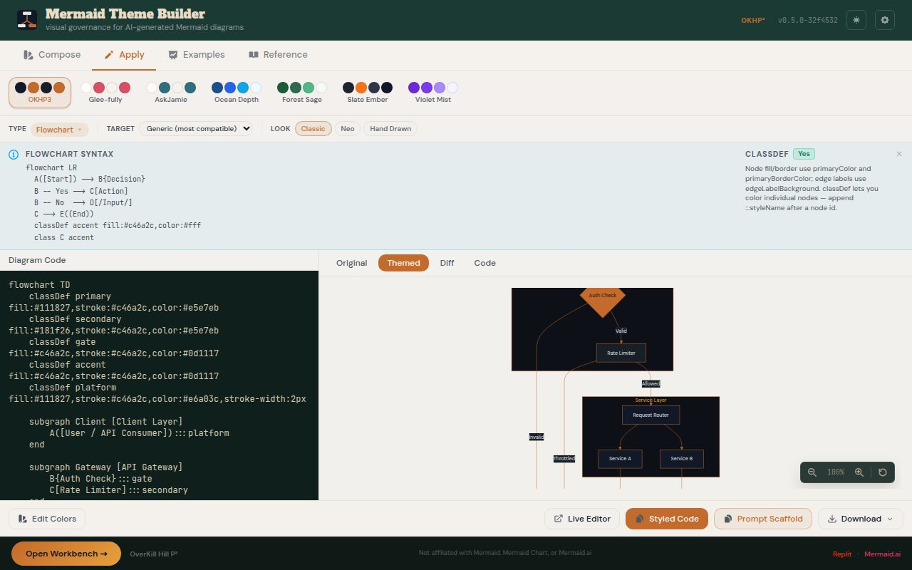

# Mermaid Theme Builder

[](https://github.com/OKHP3/mermaid-theme-builder/actions/workflows/ci.yml)
[](https://github.com/OKHP3/mermaid-theme-builder/actions/workflows/e2e.yml)
[](https://github.com/OKHP3/mermaid-theme-builder/actions/workflows/skill-tests.yml)
[](https://github.com/OKHP3/mermaid-theme-builder/actions/workflows/deploy-pages.yml)

Visual governance for AI-generated Mermaid diagrams — paste, theme, preview, and export with renderer-aware scaffolding. Reduces follow-on AI prompts with pre-prompt scaffold exports tuned for your target renderer.

**[Live Tool](https://okhp3.github.io/mermaid-theme-builder/)** · **[Project Page](https://overkillhill.com/projects/mermaid-theme-builder/)** · **[Article](https://overkillhill.com/writings/first-diagram-is-a-liar/)**



---

## Features

- **31 diagram families** detected with family-specific theming overlays (18 native, 13 partial/beta; 10 additional capability gaps documented)
- **3 rendering looks** - Classic, Neo, Hand-Drawn - sourced from Mermaid v11.16.0's look API
- **8 renderer profiles** - mermaid.live, GitHub, GitLab, Notion, Obsidian, Confluence, CLI, Microsoft Loop/M365 - with parity matrix and contextual look warnings
- **5-tier typography hierarchy** — Diagram Title → Subgraph → Nested Subgraph → Node Label → Edge Label — with enforced parent-child sizing constraints
- **Renderer-aware output format** — toggle between `%%{init}%%` directive and YAML frontmatter; defaults to the recommended format per renderer
- **Built-in brand palettes** — Overkill Hill P³, AskJamie, Glee-fully, plus Ocean Depth, Forest Sage, Slate Ember, Violet Mist and more
- **Two-way color editor** — click swatches, preview updates live
- **8-format Download menu** — `.mermaid`, `.svg`, `.png`, `.theme.json`, `.md`, `.txt` (scaffold), `.css`, `.bundle.json`
- **Renderer-aware warnings** — contextual alerts when selected look is unsupported by target renderer
- **Stroke/border width control** — per-diagram node border width stepper in Compose (Default, 1–4 px)
- **Extract mode** — dedicated Extract tab to pull a theme from existing themed Mermaid code
- **100% client-side, no data collection** — your Mermaid code, palette data, and exports stay in your browser; no data is sent to any server. No backend, no login, no analytics.
- **Installable as a PWA** — service worker and web app manifest included; add to home screen or desktop for offline-capable access

---

## Tabs

| Tab | Purpose |
|-----|---------|
| **Compose** | Design a theme from scratch, configure 5-tier typography, set border width, export prompt scaffold for LLM pre-prompting |
| **Apply** | Paste Mermaid code → select palette → select look → select renderer target → toggle output format → preview live → export |
| **Examples** | Browse diagram examples by family, preview with current theme, load into Apply |
| **Reference** | Diagram capability registry, renderer parity matrix, class library |
| **Extract** | Paste existing themed Mermaid code to import its `%%{init}%%` or YAML frontmatter as a new custom palette |

---

## Looks (Mermaid v11.16.0)

| Look | Keyword | Renderer support |
|------|---------|-----------------|
| Classic | (default, omit look key) | Universal |
| Neo | `"look": "neo"` | mermaid.live, GitHub (partial), CLI, Obsidian (partial) |
| Hand-Drawn | `"look": "handDrawn"` | mermaid.live, CLI, Obsidian (partial) — requires Rough.js |

> **Note:** Notion and Confluence plugin renderers support Classic only. GitHub's pinned Mermaid version determines Neo look availability.

---

## Renderer Parity Matrix (summary)

| Renderer | Classic | Neo | Hand-Drawn | themeVars | CSS inject | Default format |
|----------|---------|-----|------------|-----------|-----------|---------------|
| mermaid.live | Full | Full | Full | Full | Full | YAML frontmatter |
| GitHub | Full | Partial | None | Full | None | YAML frontmatter |
| GitLab | Full | Partial | None | Full | None | `%%{init}%%` |
| Notion | Full | None | None | Partial | None | `%%{init}%%` |
| Obsidian | Full | Partial | Partial | Full | Partial | YAML frontmatter |
| Confluence + Plugin | Partial | None | None | Partial | None | `%%{init}%%` |
| CLI (mmdc) | Full | Full | Full | Full | Full | `%%{init}%%` |
| Microsoft Loop/M365 | Full | None | None | Partial | None | `%%{init}%%` |

Full parity matrix with caveats is available in the **Reference** tab of the live tool.

---

## Supported Diagram Families (31 + 10 gaps)

**Native support (18):** Flowchart, Sequence, Class, State, ER, Gantt, Pie, Git Graph, Mindmap, Timeline, Quadrant Chart, User Journey, Requirement, ZenUML, Kanban, Cynefin, Railroad, Swimlane.

**Partial/beta support (13):** C4, Architecture Beta, Block, Sankey, XY Chart, Packet, Radar, Treemap, Venn, Ishikawa, Wardley, Tree View, Event Modeling.

**Documented capability gaps (10):** BPMN 2.0, ArchiMate, SysML, Value-Stream Map, Service Blueprint, OKR Alignment Map, DFD, Decision Tree, Org Chart, Threat Model DFD — tracked with "not natively supported" status so users know why they render as generic flowcharts.

> The in-app **Reference** tab is the canonical source of truth: 31 families total, 21 with native/emulatable support and 10 tracked as explicit capability gaps. The list above enumerates 38 named types and hasn't been reconciled against the live registry item-for-item. Don't treat "27+" as current either way.

Capabilities documented per family: stability, look support, themeVariable confidence, classDef support, linkStyle support, subgraph support, `minMermaidVersion`.

---

## Exports

### Toolbar — three quick copy/export options

| Button | Output |
|--------|--------|
| **Styled Code** | Mermaid code with the theme directive prepended. Toggle between `%%{init}%%` and YAML frontmatter in the toolbar. |
| **Markdown** | Full markdown file — fenced code block, palette reference, and theme metadata. |
| **Prompt Scaffold** | Structured AI thread opener: diagram type + directive, color table, 5-tier typography contract, classDef vocabulary, subgraph patterns, and a drift-recovery prompt. |

### Download menu — 8 formats

| Format | Contents |
|--------|---------|
| `.mermaid` | Themed diagram source with the chosen directive format |
| `.svg` | Rendered SVG of the themed diagram |
| `.png` | Rendered PNG of the themed diagram |
| `.theme.json` | Palette data and metadata as a portable JSON file |
| `.md` | Markdown Bootstrap — same as the Markdown toolbar button |
| `.txt` | Prompt Scaffold — same as the Prompt Scaffold toolbar button |
| `.css` | CSS custom properties for all palette values |
| `.bundle.json` | All palettes (built-in + custom) bundled as a single JSON file |

---

## Quick Start

```bash
pnpm install
# PORT and BASE_PATH are required at runtime (set by workflow)
pnpm dev  # Use the workflow runner, not bare pnpm dev
```

See `replit.md` for the full project overview and `AGENTS.md` for contributing rules.

### Development on Windows

All scripts in this repo are cross-platform. No WSL or bash is required.

**Prerequisites:** Node.js ≥ 24, pnpm ≥ 10, Git.

```powershell
pnpm install
pnpm dev
```

**Running E2E tests on Windows:**

```powershell
# Install Playwright's bundled Chromium (one-time)
pnpm exec playwright install --with-deps chromium

pnpm test:e2e
```

`pnpm test:e2e` invokes `scripts/run-e2e.mjs`, which on Windows runs Playwright directly (bypassing the NixOS-specific `LD_LIBRARY_PATH` setup in `scripts/run-e2e.sh` that is only relevant on Replit/NixOS).

---

## Tech Stack

| Layer | Technology |
|-------|-----------|
| Framework | React 19 + Vite 8 |
| Styling | Tailwind CSS v4 |
| Rendering | Mermaid.js 11.16.0 |
| Type checking | TypeScript 7.0 (strict) |
| Testing | Vitest 4 |
| Package manager | pnpm 11 (workspaces) |
| Hosting | GitHub Pages (static) |

---

## Disclaimer

Not affiliated with Mermaid, Mermaid Chart, Mermaid.ai, Builders FirstSource, or any third-party brand. OverKill Hill P³ is a personal project by Jamie Hill.

## License

MIT — see [LICENSE](LICENSE).

Built by [OverKill Hill P³](https://overkillhill.com/).

---

## Agent Skill

This repo ships a SKILL.md-compatible agent skill at `skills/okhp3-mermaid-theme-builder/`. It packages the theming logic (palette registry, renderer profiles, prompt scaffold generation) into a headless, browser-free format consumable by Claude Code, GitHub Copilot, Cursor, Gemini CLI, VS Code, and OpenAI Codex.

**Skill path:** `skills/okhp3-mermaid-theme-builder/SKILL.md`

**Trigger example:**

> "Apply the OverKill Hill P³ palette to this flowchart and make it GitHub-safe"

The skill will detect the diagram family, select the appropriate themeVariables, apply renderer constraints, and return a `%%{init}%%` directive ready to paste.

**Install (Claude Code):**

```bash
cp -r skills/okhp3-mermaid-theme-builder ~/.claude/skills/
```

**Install (Cursor):**

```bash
cp skills/okhp3-mermaid-theme-builder/SKILL.md .cursor/rules/mermaid-theme-builder.mdc
```

See `skills/okhp3-mermaid-theme-builder/README.md` for full install instructions for all platforms.

<!-- SKILLS_CATALOG_START -->
<!-- ⚠️ DO NOT EDIT THIS SECTION MANUALLY — regenerated by scripts/gen-skills-readme.py -->
<!-- Generated: 2026-08-04 UTC | Skills: 10 | Categories: 1 | Mode: library | Surface: distribution -->

*Catalog last updated: **August 4, 2026** &nbsp;·&nbsp; **10** skills across **1** categories*

### skills (10 skills)

| Skill | Description | Version |
|---|---|---|
| [okhp3-mermaid-architecture](skills/okhp3-mermaid-architecture/SKILL.md) | System and solution architecture diagrams in Mermaid for technical audiences - C4 model (Context/... | 0.3.0 |
| [okhp3-mermaid-bpmn](skills/okhp3-mermaid-bpmn/SKILL.md) | BPMN-informed business process modeling in Mermaid. Use whenever the user wants to diagram a busi... | 0.3.0 |
| [okhp3-mermaid-core](skills/okhp3-mermaid-core/SKILL.md) | Foundation skill for ALL Mermaid diagram work. Load this first for any task involving Mermaid syn... | 0.3.0 |
| [okhp3-mermaid-data](skills/okhp3-mermaid-data/SKILL.md) | Data model and relationship diagrams in Mermaid - entity-relationship (ER) diagrams, class diagra... | 0.3.0 |
| [okhp3-mermaid-governance](skills/okhp3-mermaid-governance/SKILL.md) | OverKill Hill P³ Mermaid governance profile manager. Use when establishing a visual and behavioral... | 1.1.0 |
| [okhp3-mermaid-publish](skills/okhp3-mermaid-publish/SKILL.md) | Rendering, exporting, and publishing finished Mermaid diagrams. Use after a diagram has passed ok... | 0.3.0 |
| [okhp3-mermaid-repair](skills/okhp3-mermaid-repair/SKILL.md) | Syntax repair for broken Mermaid diagrams. Use when a .mmd file or fenced Mermaid block fails to ... | 0.3.0 |
| [okhp3-mermaid-theme-builder](skills/okhp3-mermaid-theme-builder/SKILL.md) | Apply reusable color palettes and visual governance to Mermaid diagram code. Use this skill when ... | 0.6.1 |
| [okhp3-mermaid-update](skills/okhp3-mermaid-update/SKILL.md) | Style-preserving update of an existing Mermaid diagram. Use when the user provides an existing .m... | 0.3.0 |
| [okhp3-skill-promotion](skills/okhp3-skill-promotion/SKILL.md) | Promote and synchronize a project-local Agent Skill into a portable, reviewable distribution pack... | 0.1.0 |

<!-- SKILLS_CATALOG_END -->
