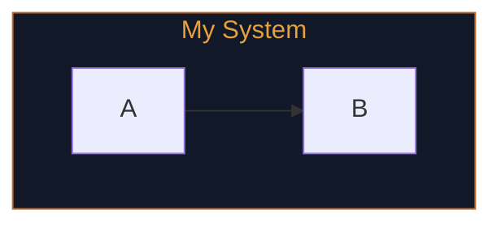

# Mermaid Theming Reference

**Verified against:** Mermaid v11.14.0  
**Owner:** OverKill Hill P³ / Jamie Hill  
**Last updated:** 2026-04-25

This document is the internal reference for Mermaid's theming system as used by Mermaid Theme Builder. It covers theme directives, the complete `themeVariables` table, renderer compatibility, and diagram-type-specific theming notes.

---

## 1. Theme directive formats

Mermaid supports two ways to specify a theme: the legacy `%%{init}%%` directive and the modern YAML frontmatter format (introduced in v10.5.0).

### 1.1 Format A — `%%{init}%%` directive (universal)

The `%%{init}%%` directive embeds JSON configuration in a Mermaid comment at the top of the diagram. It is supported by all Mermaid v9+ renderers and is the safest fallback for environments that may run older Mermaid versions.

**Syntax:**

```
%%{init: {"theme": "base", "themeVariables": {
  "primaryColor": "#111827",
  "primaryTextColor": "#e5e7eb",
  "primaryBorderColor": "#c46a2c",
  "lineColor": "#c46a2c",
  "secondaryColor": "#181f26",
  "tertiaryColor": "#1c3a34",
  "background": "#0d1117",
  "mainBkg": "#111827",
  "nodeBorder": "#c46a2c",
  "clusterBkg": "#0d1117",
  "titleColor": "#e6a03c",
  "edgeLabelBackground": "#181f26",
  "fontFamily": "DM Sans, system-ui, sans-serif"
}}}%%
```

**Rules:**
- Must appear on the very first line of the diagram, before the diagram type keyword
- The JSON value must be a valid inline JSON object (no trailing commas)
- The `theme` key must be set to `"base"` to enable full `themeVariables` override
- `fontFamily` is included directly in the `themeVariables` object (not in a separate config key)

### 1.2 Format B — YAML frontmatter (preferred, Mermaid v10.5+)

YAML frontmatter is the current Mermaid standard. It is more readable than `%%{init}%%` and officially deprecates it in Mermaid v10.5+. YAML comments are valid inside the block.

**Syntax:**

```yaml
---
# Mermaid v10.5+ preferred format
config:
  theme: base
  themeVariables:
    primaryColor: "#111827"
    primaryTextColor: "#e5e7eb"
    primaryBorderColor: "#c46a2c"
    lineColor: "#c46a2c"
    secondaryColor: "#181f26"
    tertiaryColor: "#1c3a34"
    background: "#0d1117"
    mainBkg: "#111827"
    nodeBorder: "#c46a2c"
    clusterBkg: "#0d1117"
    titleColor: "#e6a03c"
    edgeLabelBackground: "#181f26"
    fontFamily: "DM Sans, system-ui, sans-serif"
---
```

**Rules:**
- Must appear before the diagram type keyword
- YAML is indentation-sensitive — use 2-space indentation consistently
- All hex values must be quoted strings: `"#rrggbb"`
- `fontFamily` is a direct child of `themeVariables:`

---

## 2. Renderer compatibility

| Renderer | Format A (`%%{init}%%`) | Format B (YAML frontmatter) | Notes |
|----------|------------------------|-----------------------------|-------|
| **Mermaid Live Editor** (mermaid.live) | ✅ | ✅ Preferred | Supports both; YAML preferred for v10.5+ |
| **GitHub Markdown** | ✅ | ✅ (GitHub Mermaid 10.9+) | Both work in recent GitHub versions |
| **VS Code** (Mermaid Preview ext.) | ✅ | ✅ | Both supported in recent extensions |
| **Microsoft Loop** | ✅ | ⚠️ Uncertain | Use `%%{init}%%` as safe fallback in Loop |
| **Notion** | ⚠️ Partial | ❌ | Notion's Mermaid renderer may strip or ignore theme directives |
| **Confluence** | ⚠️ Partial | ❌ | Depends on which Mermaid plugin version is installed |
| **Mermaid Chart** (app.mermaid.chart) | ✅ | ✅ | Commercial platform with current Mermaid version |
| **GitLab** | ✅ | ✅ (GitLab 16.3+) | YAML frontmatter supported in recent GitLab versions |
| **npm / programmatic** | ✅ | ✅ | When calling `mermaid.render()` directly |

**Recommendation:** Use YAML frontmatter (Format B) as the default for modern renderers. Include `%%{init}%%` (Format A) as a fallback comment or alternative when targeting Microsoft Loop or environments with uncertain Mermaid versions.

---

## 3. themeVariables — complete reference

All `themeVariables` keys accepted by Mermaid's `base` theme, verified against Mermaid v11.14.0.

### 3.1 General / global variables

These variables apply to all diagram types.

| Variable | Type | Default | Description |
|----------|------|---------|-------------|
| `primaryColor` | hex | `#eee` | Fill color for primary nodes (flowchart nodes, state boxes, class boxes) |
| `primaryTextColor` | hex | `#333` | Text color on primary nodes |
| `primaryBorderColor` | hex | derived | Border/stroke color for primary nodes; derived from `primaryColor` if not set |
| `secondaryColor` | hex | derived | Fill color for secondary/alternate nodes |
| `tertiaryColor` | hex | derived | Fill color for tertiary/background nodes |
| `background` | hex | `#fff` | Page/canvas background color |
| `mainBkg` | hex | `#eee` | Main node background (often same as `primaryColor`) |
| `nodeBorder` | hex | derived | Node border color; often same as `primaryBorderColor` |
| `clusterBkg` | hex | `#ffffde` | Background fill for subgraphs and cluster groups |
| `titleColor` | hex | `#333` | Color for diagram titles (declared with `---\ntitle: ...\n---`) |
| `lineColor` | hex | `#333` | Color for connector lines, arrows, and edges |
| `textColor` | hex | `#333` | General text color (fallback; prefer `primaryTextColor`) |
| `edgeLabelBackground` | hex | `#e8e8e8` | Background fill for edge label text boxes |
| `fontFamily` | string | `trebuchet ms` | CSS font-family string for all diagram text |
| `fontSize` | string | `16px` | Base font size for diagram text |

### 3.2 Flowchart-specific variables

| Variable | Type | Description |
|----------|------|-------------|
| `clusterBorder` | hex | Border color for subgraph clusters |
| `fillType0` through `fillType7` | hex | Cyclic fill colors for nodes when no explicit class is applied |
| `edgeLabelBackground` | hex | Background for edge label text (general, also used in flowchart) |

### 3.3 Sequence diagram variables

| Variable | Type | Description |
|----------|------|-------------|
| `actorBkg` | hex | Actor box background |
| `actorBorder` | hex | Actor box border |
| `actorTextColor` | hex | Actor label text color |
| `actorLineColor` | hex | Lifeline color |
| `signalColor` | hex | Signal arrow color |
| `signalTextColor` | hex | Signal label text color |
| `labelBoxBkgColor` | hex | Label/loop box background |
| `labelBoxBorderColor` | hex | Label/loop box border |
| `labelTextColor` | hex | Text inside label/loop boxes |
| `loopTextColor` | hex | Loop text color (alternate) |
| `noteBorderColor` | hex | Note box border |
| `noteBkgColor` | hex | Note box background |
| `noteTextColor` | hex | Note box text |
| `activationBorderColor` | hex | Activation box border |
| `activationBkgColor` | hex | Activation box background |
| `sequenceNumberColor` | hex | Sequence number badge color |

### 3.4 Class diagram variables

| Variable | Type | Description |
|----------|------|-------------|
| `classText` | hex | Default text color in class boxes |
| `attributeBackgroundColorEven` | hex | Alternating attribute row background (even) |
| `attributeBackgroundColorOdd` | hex | Alternating attribute row background (odd) |

### 3.5 State diagram variables

| Variable | Type | Description |
|----------|------|-------------|
| `labelColor` | hex | State transition label text color |
| `errorBkgColor` | hex | Background for parse/render error display |
| `errorTextColor` | hex | Text for parse/render error display |
| `transitionColor` | hex | Transition line color (overrides `lineColor` for stateDiagram) |

### 3.6 Git graph variables

| Variable | Type | Description |
|----------|------|-------------|
| `git0` through `git7` | hex | Branch line colors (cyclic) |
| `gitBranchLabel0` through `gitBranchLabel7` | hex | Branch label text colors |
| `gitInv0` through `gitInv7` | hex | Inverted branch colors (commit dot text) |
| `commitLabelColor` | hex | Commit hash label text |
| `commitLabelBackground` | hex | Commit hash label background |
| `commitLabelFontSize` | string | Commit label font size |
| `tagLabelColor` | hex | Tag label text |
| `tagLabelBackground` | hex | Tag label background |
| `tagLabelBorder` | hex | Tag label border |
| `tagLabelFontSize` | string | Tag label font size |

### 3.7 Gantt chart variables

| Variable | Type | Description |
|----------|------|-------------|
| `gridColor` | hex | Grid line color |
| `section0` through `section4` | hex | Section background colors (cyclic) |
| `altSectionBkgColor` | hex | Alternate section background |
| `taskBkgColor` | hex | Default task bar background |
| `taskBorderColor` | hex | Default task bar border |
| `taskTextColor` | hex | Task label text |
| `taskTextLightColor` | hex | Task text for light-background tasks |
| `taskTextOutsideColor` | hex | Task text when outside the bar |
| `taskTextClickableColor` | hex | Clickable task text color |
| `activeTaskBkgColor` | hex | Active task bar background |
| `activeTaskBorderColor` | hex | Active task bar border |
| `doneTaskBkgColor` | hex | Completed task bar background |
| `doneTaskBorderColor` | hex | Completed task bar border |
| `critBkgColor` | hex | Critical path task background |
| `critBorderColor` | hex | Critical path task border |
| `critTextColor` | hex | Critical path task text |
| `todayLineColor` | hex | Today marker line color |

### 3.8 Pie chart variables

| Variable | Type | Description |
|----------|------|-------------|
| `pie1` through `pie12` | hex | Pie slice fill colors (cyclic) |
| `pieTitleTextColor` | hex | Pie chart title text |
| `pieTitleTextSize` | string | Pie chart title font size |
| `pieSectionTextColor` | hex | Pie section label text |
| `pieSectionTextSize` | string | Pie section label font size |
| `pieLegendTextColor` | hex | Legend text color |
| `pieLegendTextSize` | string | Legend text font size |
| `pieStrokeColor` | hex | Slice border color |
| `pieStrokeWidth` | string | Slice border width |
| `pieOpacity` | number | Slice opacity (0–1) |
| `pieOuterStrokeWidth` | string | Outer pie border width |
| `pieOuterStrokeColor` | hex | Outer pie border color |

### 3.9 User journey variables

| Variable | Type | Description |
|----------|------|-------------|
| `fillType0` through `fillType5` | hex | Actor section fill colors |
| `taskTextColor` | hex | Task label text |
| `taskBkgColor` | hex | Task bar background |
| `taskBorderColor` | hex | Task bar border |

### 3.10 Quadrant chart variables

| Variable | Type | Description |
|----------|------|-------------|
| `quadrant1Fill` | hex | Quadrant 1 (top-right) background |
| `quadrant2Fill` | hex | Quadrant 2 (top-left) background |
| `quadrant3Fill` | hex | Quadrant 3 (bottom-left) background |
| `quadrant4Fill` | hex | Quadrant 4 (bottom-right) background |
| `quadrant1TextFill` | hex | Quadrant 1 label text |
| `quadrant2TextFill` | hex | Quadrant 2 label text |
| `quadrant3TextFill` | hex | Quadrant 3 label text |
| `quadrant4TextFill` | hex | Quadrant 4 label text |
| `quadrantPointFill` | hex | Data point fill |
| `quadrantPointTextFill` | hex | Data point label text |
| `quadrantXAxisTextFill` | hex | X-axis label text |
| `quadrantYAxisTextFill` | hex | Y-axis label text |
| `quadrantInternalBorderStrokeFill` | hex | Internal divider line color |
| `quadrantExternalBorderStrokeFill` | hex | Outer border color |
| `quadrantTitleFill` | hex | Chart title color |

---

## 4. Theme support by diagram type

| Diagram type | Format | `themeVariables` support | `classDef` | `linkStyle` | Subgraph style |
|---|---|---|---|---|---|
| `flowchart` | stable | Full | ✅ | ✅ | ✅ |
| `sequenceDiagram` | stable | Partial | ❌ | ❌ | ❌ |
| `classDiagram` | stable | Partial | ✅ | ❌ | ❌ |
| `stateDiagram` | stable | Partial | ✅ | ❌ | ❌ |
| `erDiagram` | stable | Partial | ❌ | ❌ | ❌ |
| `gantt` | stable | Limited | ❌ | ❌ | ❌ |
| `pie` | stable | Limited | ❌ | ❌ | ❌ |
| `gitGraph` | stable | Limited | ❌ | ❌ | ❌ |
| `mindmap` | stable | Limited | ❌ | ❌ | ❌ |
| `timeline` | stable | Limited | ❌ | ❌ | ❌ |
| `quadrantChart` | stable | Partial | ❌ | ❌ | ❌ |
| `journey` | stable | Limited | ❌ | ❌ | ❌ |
| `requirementDiagram` | stable | Partial | ❌ | ❌ | ❌ |
| `c4Diagram` | stable | Partial | ❌ | ❌ | ❌ |
| `architecture-beta` | beta | Limited | ❌ | ❌ | ❌ |
| `block-beta` | beta | Partial | ✅ | ❌ | ❌ |
| `sankey-beta` | beta | Limited | ❌ | ❌ | ❌ |
| `xychart-beta` | beta | Partial | ❌ | ❌ | ❌ |
| `packet-beta` | beta | Limited | ❌ | ❌ | ❌ |
| `kanban` | stable | Limited | ❌ | ❌ | ❌ |
| `treemap-beta` | experimental | Limited | ❌ | ❌ | ❌ |
| `venn-beta` | experimental | Limited | ❌ | ❌ | ❌ |
| `ishikawa-beta` | experimental | Limited | ❌ | ❌ | ❌ |
| `wardley-beta` | experimental | Limited | ❌ | ❌ | ❌ |
| `treeView-beta` | experimental | Limited | ❌ | ❌ | ❌ |

Support levels:
- **Full** — all standard `themeVariables` apply reliably
- **Partial** — global variables (background, text, borders) apply; diagram-specific elements have variable support
- **Limited** — only background and title colors apply; internal colors are managed by Mermaid's renderer

See `src/data/mermaid-capabilities.ts` for the machine-readable version of this table.

---

## 5. classDef syntax reference

`classDef` allows styling individual nodes in diagrams that support it (flowchart, classDiagram, stateDiagram, block-beta).

### Define a class

```mermaid
classDef primary fill:#111827,stroke:#c46a2c,color:#e5e7eb
classDef gate fill:#c46a2c,stroke:#c46a2c,color:#0d1117
classDef boundary fill:#0d1117,stroke:#c46a2c,color:#e6a03c,stroke-dasharray:5
```

### Apply a class

```mermaid
A[Node]:::primary
B{Decision}:::gate
subgraph boundary
    C[Item]:::secondary
end
```

### Supported CSS properties in classDef

| Property | Example | Notes |
|----------|---------|-------|
| `fill` | `fill:#111827` | Node background color |
| `stroke` | `stroke:#c46a2c` | Node border color |
| `color` | `color:#e5e7eb` | Text color |
| `stroke-width` | `stroke-width:2px` | Border width |
| `stroke-dasharray` | `stroke-dasharray:5` | Dashed border |
| `font-style` | `font-style:italic` | Text style |
| `font-weight` | `font-weight:bold` | Text weight |
| `opacity` | `opacity:0.7` | Node opacity |

---

## 6. Subgraph style syntax

In flowchart diagrams, subgraph styling uses `style` statements:



The `style` ID must match the subgraph identifier exactly (case-sensitive).

---

## 7. Metadata comments

Mermaid ignores any line starting with `%%` as a comment. These are used by Mermaid Theme Builder to embed provenance metadata:

```
%% Created with: Mermaid Theme Builder v0.1.0
%% Tool: https://overkillhill.com/projects/mermaid-theme-builder/
%% Theme: OverKill Hill P³
%% Theme ID: overkill-hill
%% Theme Version: 0.1.0
%% Generated: 2026-01-01T00:00:00.000Z
%% Personal OverKill Hill P³ project by Jamie Hill — overkillhill.com
%% Not affiliated with Builders FirstSource, Mermaid, Mermaid Chart, or Mermaid.ai
```

Comments are valid anywhere in a Mermaid diagram and are silently ignored by all compliant renderers.

---

## 8. Known rendering quirks

### Microsoft Loop

- Loop uses an embedded Mermaid renderer that may lag behind the latest npm release
- YAML frontmatter support is uncertain in Loop — use `%%{init}%%` as the safe fallback
- Some `themeVariables` may be partially overridden by Loop's own CSS

### GitHub Markdown

- GitHub renders Mermaid in fenced code blocks tagged ` ```mermaid `
- Both `%%{init}%%` and YAML frontmatter work in GitHub (Mermaid 10.9+)
- GitHub's Content Security Policy may block external font-family references

### Notion

- Notion's Mermaid renderer is typically older than the current npm release
- `themeVariables` may be partially or fully ignored
- Treat Notion as a limited renderer; do not rely on theme directives rendering correctly

### VS Code

- The Mermaid Preview extension (`bierner.markdown-mermaid`) ships its own Mermaid version
- Both formats supported in extensions with Mermaid 10.5+
- Update the extension regularly to stay current with format support

---

*This document is maintained by OverKill Hill P³ and is verified against Mermaid v11.14.0.*
*Mermaid Theme Builder is a personal project by Jamie Hill — overkillhill.com*
*Not affiliated with Builders FirstSource, Mermaid, Mermaid Chart, or Mermaid.ai.*
