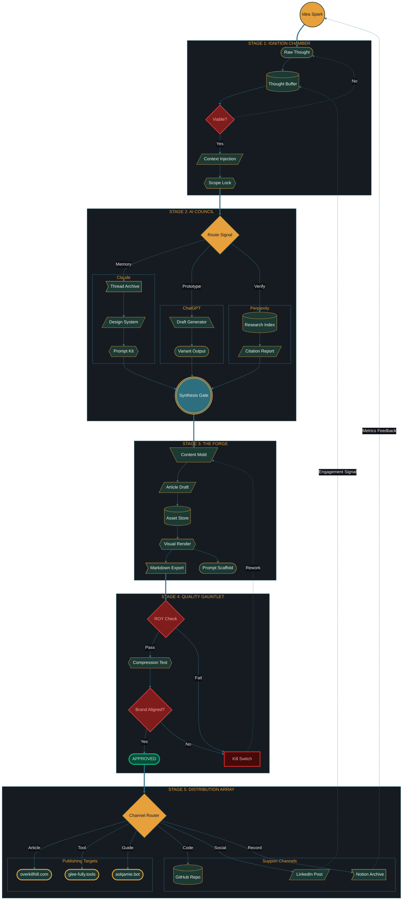

# The OverKill Hill Content Machine

> A Rube Goldberg in diagram form. Showcase diagram for Mermaid Theme Builder.
> 5 primary subgraphs, 7 total (nested), 30+ nodes, 8+ shape types, 3 hyperlinked brand nodes, 6 semantic classDef classes, bidirectional feedback loops.

## Diagram

## Features Demonstrated

| Feature | Count | Details |
|---------|-------|---------|
| Subgraphs | 7 (5 primary + 2 nested) | IGNITION, COUNCIL, FORGE, GAUNTLET, DEPLOY + nested CL/GP/PX, SITES, SUPPORT |
| Direction changes | 3 | TB (main), LR (IGNITION, FORGE, nested lanes), TB (COUNCIL, GAUNTLET, DEPLOY) |
| Shape types | 8+ | Circle, stadium, cylinder, diamond, hexagon, parallelogram-R, parallelogram-L, trapezoid, asymmetric, double-circle, triple-circle |
| Hyperlinked nodes | 3 | overkillhill.com, glee-fully.tools, askjamie.bot |
| Edge types | 4 | Solid arrow, dotted arrow, thick arrow (==>), labeled edges |
| classDef classes | 6 | brand, accent, gate, signal, kill, approved |
| Feedback loops | 2 | Metrics Feedback, Engagement Signal (both return to top) |
| Total nodes | 33 | Across all subgraphs |
| Total edges | 30+ | Including cross-subgraph connections |

## Theme Palette (OverKill Hill P3)

| Token | Hex | Role |
|-------|-----|------|
| primaryColor | #1C3A34 | Teal dark (node fill) |
| primaryTextColor | #F6F2EE | Paper cream (text) |
| primaryBorderColor | #E6A03C | Amber forge (borders) |
| lineColor | #2D6F7E | Teal accent (edges) |
| secondaryColor | #2D6F7E | Teal accent (secondary nodes) |
| background | #0d1117 | GitHub dark surface |
| clusterBkg | #161b22 | Subgraph panels |
| clusterBorder | #2D6F7E | Subgraph borders |

---

*Generated for Mermaid Theme Builder by OverKill Hill P3*
