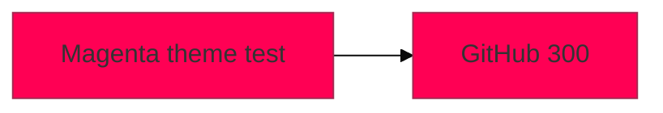
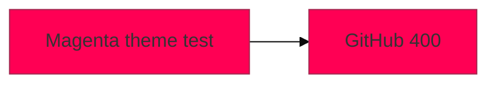

# Temporary GitHub Mermaid init-directive length test

This temporary public file measures whether GitHub's Mermaid renderer stops applying a valid theme at a particular directive character count.

For each diagram, confirm whether its nodes render with a visibly magenta/pink fill or border. Record each result as **applies** or **does not apply**. A diagram parse/render failure counts as **does not apply**.

The only difference between fixtures is the first-line directive length. The _pad value is intentionally ignored by Mermaid and only makes that directive an exact length.

## 100-character directive

Directive length: **100 characters** (from the first percent sign through the last percent sign).

## 200-character directive

Directive length: **200 characters** (from the first percent sign through the last percent sign).

## 300-character directive

Directive length: **300 characters** (from the first percent sign through the last percent sign).

## 400-character directive

Directive length: **400 characters** (from the first percent sign through the last percent sign).

## 500-character directive

Directive length: **500 characters** (from the first percent sign through the last percent sign).

## 600-character directive

Directive length: **600 characters** (from the first percent sign through the last percent sign).

---

**Expected indicator:** a valid directive applies the base theme with primaryColor: #ff0054.

**Measurement scope:** GitHub's hosted Mermaid renderer only. This does not measure GitLab or local Mermaid parser behavior.
